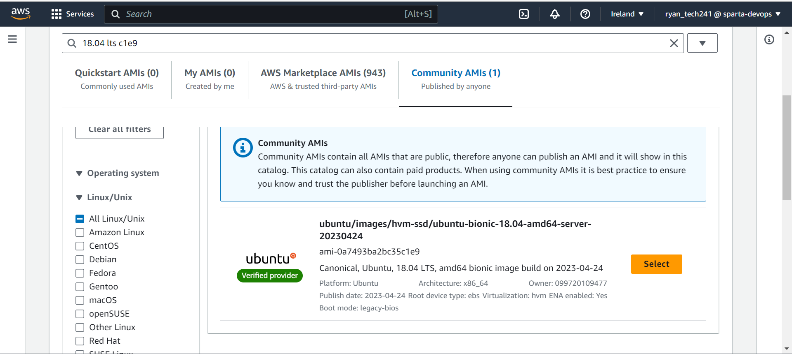

# Launching EC2
1. Create or use existing key pair.
2. Name virtual machine
3. Choose application os image - search ec2 - 18.04 lts 1e9 for: ubuntu/images/hvm-ssd/ubuntu-bionic-18.04-amd64-server-20230424 ami-0a7493ba2bc35c1e9. 
4. Instance type t2.micro
5. Select key pair
6. Create or use existing security group. HTTP, SSH and port 3000 for app vm. SSH and 27017 for DB. Allow traffic from anywhere.
7. Delete vm by terminating 

# Key points for using scripts on AWS
1. Add port 27017 and allow from anywhere to database vm
2. Use private IP for environment variable on the app script.
3. Ensure cd is going to correct place.

# AMI/User data
Inputting user data when launching an EC2 instance allows us to automate the running of the script. This can then be copied as an ami and be used as preconfigured settings when launch EC2 instances. By doing this it can cost less as less storage is used compared to making a vm for everything.
1. Launch EC2 with script as user data
2. Go to actions and select create image
3. Name image/ami and add a tag with same name
4. Launch instance from ami

# Pros and Cons of Using Public IP and Private IP

## Public IP:
### Pros:
- Global Accessibility: Public IP addresses are routable on the public internet, allowing devices with public IPs to be directly accessible from anywhere in the world.
- Hosting Services: Public IPs are essential for hosting websites, servers, or any publicly accessible services.
- Peer-to-Peer Connections: Public IP addresses enable direct peer-to-peer connections between devices, useful for applications like online gaming or file sharing.

### Cons:
- Security Risks: Being globally accessible, devices with public IP addresses are more exposed to potential security threats from malicious users or automated scans.
- Limited Availability: Due to the limited pool of available public IP addresses, it can be challenging to obtain a unique public IP for each device in a network, especially with the increasing number of internet-connected devices.
- Cost: In some cases, public IP addresses may come with additional costs, especially when obtained in large quantities or from internet service providers.

## Private IP:
### Pros:
- Security: Private IP addresses are not directly accessible from the public internet, providing a level of inherent security as they are hidden behind network address translation (NAT) routers or firewalls.
- Cost-Efficiency: Private IP addresses can be reused within private networks, reducing the need for obtaining and managing multiple public IP addresses.
- Simplified Network Management: Private IP addresses allow for easier management of internal networks as they can be assigned freely without requiring coordination with external entities.

### Cons:
- Limited Accessibility: Private IP addresses are not accessible from the public internet without network address translation (NAT) or port forwarding configurations, which can complicate certain applications and services.
- Dependency on NAT: When accessing the internet, private IP addresses rely on network address translation (NAT) routers, which can introduce latency or performance bottlenecks.
- Incompatibility with certain services: Some online services or applications may require devices with public IP addresses, making it necessary to use additional techniques like VPNs or port forwarding.

It's important to note that public and private IP addresses serve different purposes and are often used in conjunction within a network. Public IPs are typically assigned to devices or services that require public accessibility, while private IPs are used for internal network communication.

### Public IP of db in web browser, will it work?
In short no. For a few reasons, firstly a web server hasn't been created by downloading nginx on this machine, secondly there are no http or https allowed in the nsg.