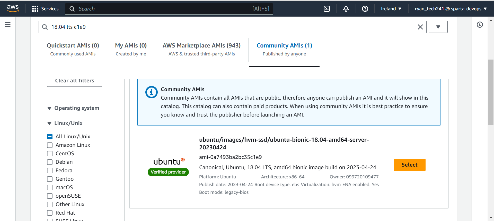

# Launching EC2
1. Create or use existing key pair.
2. Name virtual machine
3. Choose application os image - search ec2 - 18.04 lts 1e9 for: ubuntu/images/hvm-ssd/ubuntu-bionic-18.04-amd64-server-20230424 ami-0a7493ba2bc35c1e9. 
4. Instance type t2.micro
5. Select key pair
6. Create or use existing security group. HTTP, SSH and port 3000 for app vm. SSH and 27017 for DB. Allow traffic from anywhere.
7. Delete vm by terminating 

# Key points for using scripts on AWS
1. Add port 27017 and allow from anywhere to database vm
2. Use private IP for environment variable on the app script.
3. Ensure cd is going to correct place.

# AMI/User data
Inputting user data when launching an EC2 instance allows us to automate the running of the script. This can then be copied as an ami and be used as preconfigured settings when launch EC2 instances. By doing this it can cost less as less storage is used compared to making a vm for everything.
1. Launch EC2 with script as user data
2. Go to actions and select create image
3. Name image/ami and add a tag with same name
4. Launch instance from ami