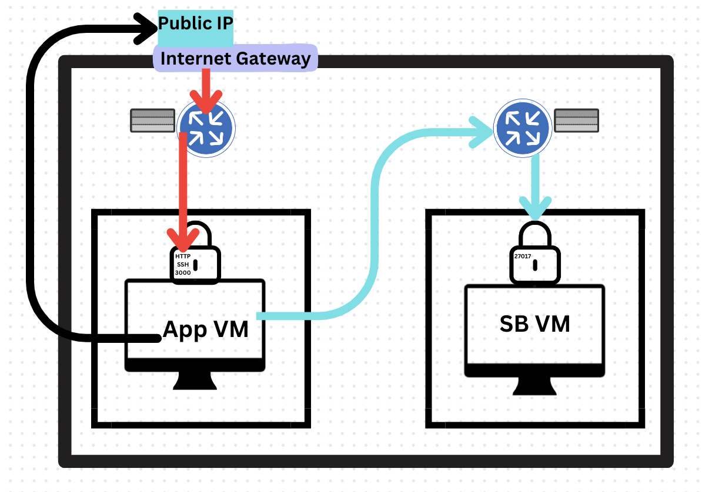

# Virtual Private Cloud
VPC stands for Virtual Private Cloud. It is a virtual network infrastructure provided by cloud computing platforms like Amazon Web Services (AWS), Microsoft Azure, and Google Cloud Platform (GCP).

A VPC allows you to create a logically isolated section within the cloud where you can launch and configure cloud resources, such as virtual machines, databases, load balancers, and other services. It provides network-level security and enables you to define and control the network environment for your cloud resources. This can be done through the subnets, for example you can place resources within a public subnet so it can be accessed through the internet or a private subnet for resources that might contain confidential information. Therefore, the private subnet can only be accessed through resources within the VPC.

## VPC Benefits for Business and DevOps

### Benefits for Business:
- **Enhanced Security**: VPCs provide isolation and security controls, ensuring the confidentiality and integrity of business data.
- **Cost Efficiency**: VPCs enable businesses to optimize resource allocation, resulting in cost savings by leveraging the scalability and flexibility of cloud infrastructure.
- **Network Customization**: VPCs allow businesses to tailor the network configuration to their specific requirements, facilitating efficient communication between cloud resources.
- **Hybrid Connectivity**: VPCs enable seamless integration with on-premises infrastructure, supporting hybrid cloud deployments and facilitating data transfer between environments.
- **High Availability**: VPCs offer built-in availability features such as availability zones, enhancing business continuity and minimizing service disruptions.

### Benefits for DevOps:
- **Infrastructure Automation**: VPCs enable the provisioning of cloud resources programmatically, facilitating infrastructure automation and accelerating development and deployment cycles.
- **Scalability and Elasticity**: DevOps teams can leverage VPCs to quickly scale resources up or down based on demand, ensuring optimal performance and cost-efficiency.
- **Network Segmentation**: VPCs allow DevOps teams to create multiple subnets and apply network segmentation, enabling isolation and improved security for different application components.
- **Testing and Staging Environments**: VPCs enable the creation of isolated testing and staging environments, allowing DevOps teams to safely test new features or perform quality assurance before production deployment.
- **Collaboration and Agility**: VPCs support collaborative development and provide a flexible environment where DevOps teams can iterate, experiment, and deploy applications quickly.

## Introduction of VPCs by AWS

AWS introduced VPCs (Virtual Private Clouds) to address key challenges and provide unique benefits in cloud computing.

### Key Advantages of VPCs:
1. **Isolation and Security**: VPCs enable customers to create isolated virtual networks, ensuring enhanced security and control over their resources.

2. **Customization and Control**: VPCs allow businesses to tailor their network configuration, including IP address ranges, subnets, and routing, to meet specific requirements.

3. **Hybrid Cloud Connectivity**: VPCs facilitate seamless integration between on-premises infrastructure and AWS resources, supporting hybrid cloud environments.

4. **Scalability and Elasticity**: VPCs provide the ability to scale network resources dynamically, accommodating varying workloads and optimizing resource allocation.

5. **Compliance and Regulatory Requirements**: VPCs assist in meeting industry-specific compliance standards and regulatory obligations through enhanced security measures within the virtual network.

In summary, AWS introduced VPCs to enhance security, enable customization, support hybrid cloud connectivity, ensure scalability, and meet compliance requirements. VPCs offer businesses greater control and flexibility in managing their cloud network infrastructure.

## VPC Diagram
The following diagram shows how traffic is routed (using routers) in the VPC.

### Adding app vm into public subnet
1. Launch instance
2. Name
3. AMI
4. Key pair name
5. Create new security group
6. Select vpc
7. Subnet
8. Add public IP
9. Add SSH and HTTP to seciroty group rule and ensure source anywhere
10. Add custom TCP port 3000, anywhere again
11. Add provision app script - remove export command as we are not connecting to db vm yet
12. Launch instance